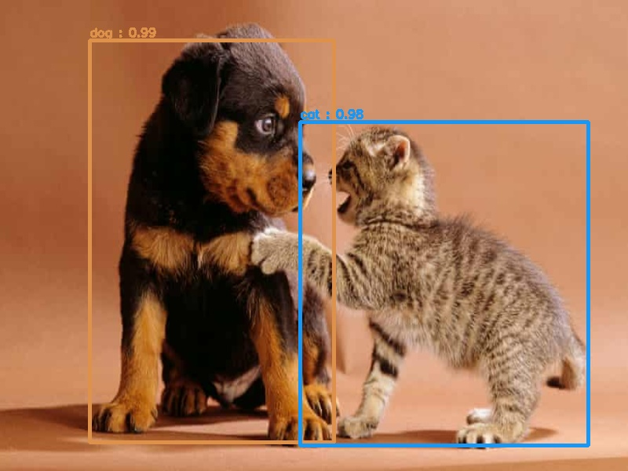
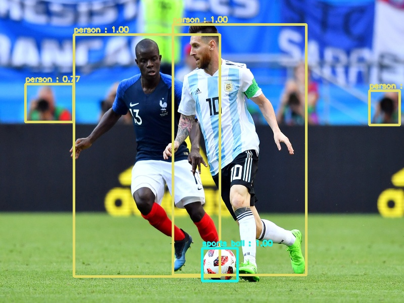
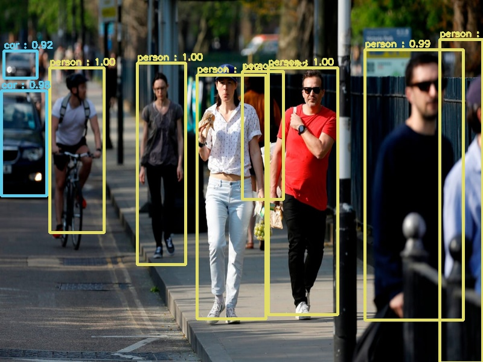

### ⭕Object Detection Project With YOLOv3 Model
---

### 📄Description
---
In this project our purpose is to use the YOLOv3 pre-trained model for detecting pre-specified objects in images/videos.YOLO algorithms are 'single-stage detectors'.As its name suggests, this type of algorithms detect objects without extracting `region proposals` by another model. So this algorithms have a high speed in terms of detecting objects and easily used for real-time object detection algorithms. Unlike two-stage detector algorithms(like `R-CNNs` , `Fast R-CNNs` and `Faster R-CNNs`, YOLO algorithms are not that accurate.In other words there is a trade-off between `speed` and `accuracy` in object detection algorithms.

Unlike most object detection algorithms, YOLO variants do not localize the object(s) in the image/video. Instead these algorithms split the input image into `SxS` grid. In each grid we have `m` number of bounding boxes and each bounding box returns a class probability and offset values,(offset values are defined for bounding boxes to fit the object more accurately. The bounding boxes that have the value that is higher than the threshold values, are kept to locate the object in the image. The below image shows the process of YOLO algorithms briefly.

[Image Source](https://www.pyimagesearch.com/2018/11/12/yolo-object-detection-with-opencv/)

### 🛠Installation & Configuration
---
In this specific project the third verion of YOLO algorithm was used. This version has higher mAP on COCO dataset and higher speed among other versions. In addition to that is already trained on the COCO dataset, so no training is required! 
To use the YOLO for object detection you need three component:
* coco.names
* yolov3.cfg
* yolov3.weights
the first two are availble at `yolo-coco` folder and you can access the last one in this [link](https://pjreddie.com/darknet/yolo/).
The picture down below shows the YOLOv3 performace in terms of other object detection algorithms.

### Results
---

### ❌Limitations
---
YOLO models have some limitations and drawbacks. As mentioned one of them is their accuracy. YOLO models have less accuracy than two-staged models in such a way that the may detect some objects that have weak class probabilities. i.e this model may detects an SUV as a truck or detects a train as a bus. Small objects(especially if they represent as a group in image) may cause a problem for YOLOs in such a way that, the YOLO may not even detect them as objects. Because of that we may have lots of false negative in some situations.

## 🛠Requirements
---
| Module/Framework        | Version           |
| ----------------------- |:-----------------:|
| numpy                   | 2.4.1             |
| cv2                     | 2.5.0             |
| imutils                 | 0.22.2.post1      |

### ❌Bugs & Issues
---
If you ever encountered any bugs in this projects or any technical issues you can report it by `issues` section of this repository or you can contact me by my email address. 

### 👥Contributers
---
Kasra1377 
